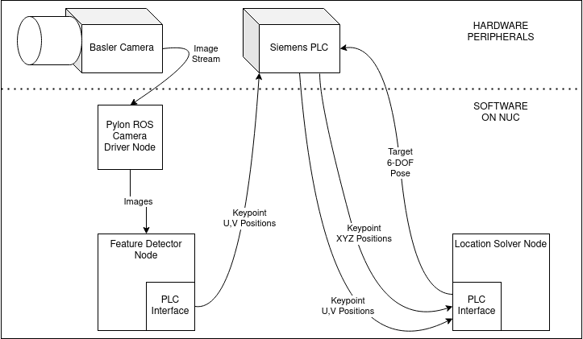

# Cognex Demo

## Block Diagram

## Target Preparation
- I have included a copy of the 5x5 modified circle grid from ROS-I's Industrial Calibration repository. It can be found in the `support` directory.
- Because the PLC was only set up for 20 points, I cut off the 5 points furthest in the `x` direction.
- Make sure the PDF is printed off to-scale, or it will throw off the target-finder.

## Further Work
To substitute the basler for a cognex
- Change the expected number of points being loaded from the plc (basically do a find and replace for `20`)
- Make a simple node to publish a CameraInfo message with the cognex intrinsics
- Update the relative positions in either the plc_initializer node or directly in the PLC
